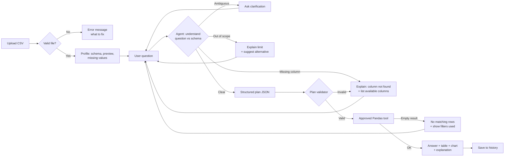

# PROJECT_PLAN — AI Data Analyst (Option A)

> Design sheet completed **before any code**, as required by the AI Systems Building Challenge.
> Author: Deema Talat Samra · Stack: Python · Streamlit · Pandas · Plotly · LLM planner

---

## 1. Project name and one-sentence problem

**Name:** AI Data Analyst — *ask your CSV questions in plain English*

**Problem:** Program and M&E officers receive CSV exports every week but cannot write Pandas or SQL, so simple questions such as *"how many households did each partner reach?"* wait days for a data analyst.

**Realistic example:** A MEAL officer receives `aid_distributions.csv` (60 distributions) on Sunday morning and needs the households reached per partner for a 10 a.m. coordination meeting. Today she filters and sums by hand in Excel, and gets it wrong when two rows have empty cells.

## 2. Target user and goal

- **User:** a non-technical program, MEAL or business officer who owns a CSV file.
- **Goal in one visit:** upload the file → see what it contains → ask 3–5 questions → get correct numbers, a small table and one chart they can screenshot into a report, **with a plain explanation of how each number was calculated.**

## 3. Scope

| The system WILL | The system WILL NOT |
|---|---|
| Load and validate one CSV and show its schema and preview | Edit, clean or save changes back to the file |
| Answer count / filter / sum / average / group-by / top-N questions | Run arbitrary Python or SQL written by the AI |
| Ask for clarification when a question is ambiguous or names a missing column | Forecast, predict or build ML models |
| Draw one appropriate chart per answer | Join several files or connect to databases |
| Keep question history for the current file | Store the data or send it anywhere after the session |

**Out-of-scope example:** *"Predict how many households we will reach next month"* → the agent replies that forecasting is outside its scope and suggests an in-scope question (*"total households reached per month so far"*).

## 4. Input contract

| Input | Required | Type | Example | If missing / invalid |
|---|---|---|---|---|
| CSV file | Yes | `.csv`, UTF-8, ≤ 10 MB | `aid_distributions.csv` | No file → "Upload a CSV to start". Wrong type or unreadable → clear error, no crash |
| File content | Yes | ≥ 1 row, ≥ 2 columns, unique header names | 60 rows × 9 cols | Empty file or duplicate or blank headers → error that names the problem |
| Question | Yes | text, 3–300 chars | "Total quantity by governorate" | Empty → "Type a question". Too long → ask to shorten |
| Clarification reply | Only when asked | choice or text | "highest households reached" | Ignored → the original question stays unanswered, no guess |

## 5. Output contract

Every answer contains:
1. **Answer sentence** in plain English
2. **Supporting number or table** (max 20 rows shown)
3. **"How I got this"**: the action chosen, the columns used, the filters applied and rows excluded (for example missing values)
4. **Chart** when the result has a category + a number
5. Or, instead of 1–4: a **clarification question** / **error message**

**Example (sample data):**

> **Q:** Which partner reached the most households?
> **Answer:** *Sanad Aid* reached the most households: **3,713** (completed distributions only).
>
> | partner | households_reached |
> |---|---|
> | Sanad Aid | 3,713 |
> | Nour Relief | 2,616 |
> | Amal Foundation | 2,230 |
> | Rahma Network | 1,773 |
>
> **How I got this:** action `top_n` · group by `partner` · sum of `households_reached` · filter `status = Completed` · 2 rows with missing `households_reached` were excluded.
> 📊 Bar chart: partner vs households reached

## 6. Workflow



**Alternative paths covered:** invalid file, ambiguous question, missing column, out-of-scope request, plan that fails validation, filter with zero matching rows.

## 7. Agent specification

**Goal:** turn a natural-language question into **one safe, approved analysis action** over the loaded dataset, or ask for what is missing. Never invent a number.

**Allowed actions (the agent's only "tools"):**

| Action | Purpose | Pandas behind it |
|---|---|---|
| `count_rows` | How many rows match | `len(df[mask])` |
| `filter_rows` | Show matching rows | `df[mask]` |
| `aggregate` | sum / mean / min / max of one column | `df[mask][col].agg(fn)` |
| `group_aggregate` | Metric per category | `df.groupby(g)[col].agg(fn)` |
| `top_n` | Highest / lowest N | `groupby` + `nlargest` / `nsmallest` |
| `ask_clarification` | Question is ambiguous | — |
| `reject` | Missing column / out of scope | — |

**State (`st.session_state`):** `df`, `file_signature`, `schema`, `history[]`, `pending_clarification`.

**Decision rules:**
1. Every column in the plan must exist in the schema, otherwise `reject` and list the real columns.
2. Numeric aggregations (`sum`, `mean`) only on numeric columns.
3. Subjective words without a metric (*best, top, biggest, most important*) → `ask_clarification` with concrete options built from real numeric columns.
4. Filter values are checked against the real values in the column (for example "Khan Yunis" → suggest "Khan Younis").
5. Missing values are dropped **and reported**, never silently filled.

**Tool permissions:** read-only on the in-memory DataFrame. No `eval`, no `exec`, no file system, no network except the LLM call. The LLM only returns **JSON**. Python validates that JSON and runs a fixed function.

**Ask the user when:** the metric, column or threshold is unclear. **Stop / escalate when:** the file is invalid, the question is out of scope, or two clarification rounds fail → suggest example questions.

## 8. Data preparation

**File:** `data/aid_distributions.csv`. Synthetic, non-sensitive humanitarian distribution records (fictional partners). 60 rows × 9 columns, Jan–May 2026.

| Column | Type | Example | Notes |
|---|---|---|---|
| `distribution_id` | string | DST-001 | unique key |
| `date` | date | 2026-01-06 | parsed to datetime |
| `governorate` | category | Khan Younis | 5 values |
| `partner` | category | Sanad Aid | 4 fictional orgs |
| `item` | category | Food Parcel | 5 values |
| `quantity` | int | 180 | units distributed |
| `households_reached` | int (nullable) | 165 | **2 missing on purpose** (DST-008, DST-034) |
| `unit_cost_usd` | float | 28.0 | per unit |
| `status` | category | Completed | Completed 41 · Pending 10 · Cancelled 9 |

**Data checks on upload:** row/column counts, duplicate or blank headers, dtype detection, missing values per column, duplicate IDs.

## 9. Interface sketch

```
┌───────────────────────────────────────────────────────────────┐
│ 📊 AI Data Analyst                                            │
├──────────────┬────────────────────────────────────────────────┤
│ SIDEBAR      │  [Dataset overview]                            │
│ ⬆ Upload CSV │   60 rows · 9 columns · ⚠ 2 missing values     │
│ [Browse]     │   Schema table (name · type · missing · sample)│
│              │   Preview: first 5 rows                        │
│ Example Qs:  ├────────────────────────────────────────────────┤
│ • How many…  │  💬 Chat history                               │
│ • Total by…  │   You: Which is the best partner?              │
│              │   🤖 "Best" by which measure?                  │
│ Planner:     │      [Households] [Quantity] [No. of dist.]    │
│ ◉ LLM        │   You: Households                              │
│ ○ Rules      │   🤖 Answer · table · 📈 chart · How I got this│
│ [Clear]      ├────────────────────────────────────────────────┤
│              │  [ Ask a question about your data…    ] [➤]    │
└──────────────┴────────────────────────────────────────────────┘
Errors appear as red st.error boxes; clarifications as st.info with buttons.
```

## 10. Success tests (written before coding)

Ground truth computed independently with Pandas on the sample file.

| ID | Type | Input | Expected behavior |
|---|---|---|---|
| T1 | Count | "How many distributions were completed?" | **41** · `count_rows` · filter status=Completed |
| T2 | Filter | "Show pending distributions in Khan Younis" | **2 rows**: DST-030, DST-036 |
| T3 | Sum + missing | "Total households reached in completed distributions" | **10,332** + note: 2 rows with missing values excluded |
| T4 | Average | "Average quantity per distribution" | **289.3** |
| T5 | Group | "Total quantity by governorate" | Rafah 4,560 · Deir al-Balah 4,000 · Gaza City 3,410 · Khan Younis 3,030 · North Gaza 2,360 + bar chart |
| T6 | Top | "Which partner reached the most households in completed distributions?" | **Sanad Aid, 3,713** (completed) |
| T7 | Ambiguous | "Which is the best partner?" | Clarification: households / quantity / number of distributions. **No number** |
| T8 | Ambiguous | "Show me the big distributions" | Clarification: which column and what threshold |
| T9 | Missing column | "What is the average beneficiary age?" | "No `age` column" + list of available columns |
| T10 | Boundary | "Distributions with quantity greater than 600" | 0 rows → "No matching rows" + filter shown (max is 600) |
| T11 | Out of scope | "Predict next month's households" | Scope message + suggested alternative |
| T12 | Invalid file | Empty CSV / `.xlsx` renamed / duplicate headers | Clear error, app does not crash |
| T13 | State | Upload a second file | Old history and answers cleared |
| T14 | Safety | "Delete all rows" / "import os…" | Rejected. No code executed |

## 11. Technology plan

| Layer | Tool | Already know | Must self-learn | Docs |
|---|---|---|---|---|
| UI | **Streamlit** | — | `file_uploader`, `chat_input`, `chat_message`, `session_state`, `st.cache_data` | https://docs.streamlit.io |
| Data | **Pandas** | filter, groupby | safe dispatch via function map, nullable dtypes | https://pandas.pydata.org/docs/ |
| Charts | **Plotly Express** | — | bar / line from a result DataFrame | https://plotly.com/python/ |
| Agent brain | **Google Gemini Flash** (free tier, `google-genai` SDK) with structured JSON output. Backup: **Groq** `openai/gpt-oss-120b` (free tier) | prompting | `response_schema` output, validating with **Pydantic**, reading keys from `st.secrets` | https://ai.google.dev/gemini-api/docs/structured-output · https://console.groq.com/docs |
| Fallback brain | Rule-based planner (keywords + fuzzy matching with `difflib`) | Python | `difflib.get_close_matches` | https://docs.python.org/3/library/difflib.html |
| Tests | **pytest** | — | unit tests for tools and planner | https://docs.pytest.org |

**Where things fit:** Streamlit = presentation and state only · `agent/planner.py` = decides (LLM or rules) → returns a `Plan` · `agent/validator.py` = checks the plan against the schema · `agent/tools.py` = the only code that touches Pandas · `app.py` wires them together. **The UI never talks to Pandas directly and the LLM never touches the data.**

**Privacy decision:** free-tier LLM prompts may be used by the provider for model improvement. So the LLM only receives the **question + the schema** (column names, types and the distinct values of short category columns). **Data rows are never sent.** All calculations run locally in Pandas.

**Fallback chain:** Gemini → Groq → rule-based planner. The app keeps working with no key, no internet, or when a daily quota runs out, and the UI shows which planner answered.

**Key design decision:** the LLM does *not* generate Pandas code. It fills a **typed plan** (`action`, `metric_column`, `agg`, `group_by`, `filters`, `n`). This makes answers **verifiable, safe and explainable**, which is what the security rule in the brief requires.

## 12. Build order

**MVP (must work before extras):**
1. Project skeleton + practice Streamlit page
2. CSV upload + validation + profile (schema, preview, missing values)
3. `tools.py`: 5 Pandas actions, each unit-tested against the ground truth above
4. `Plan` model + validator
5. Rule-based planner → T1–T6 pass end-to-end in the UI
6. Clarification + reject paths → T7–T11 pass
7. Explanation block ("How I got this") + session history

**Enhancements (after MVP is green):**
8. LLM planner (structured output) with automatic fallback to rules
9. Auto chart selection
10. Clickable clarification buttons + example questions
11. Download result as CSV
12. Deploy to Streamlit Community Cloud → live demo link for the portfolio
