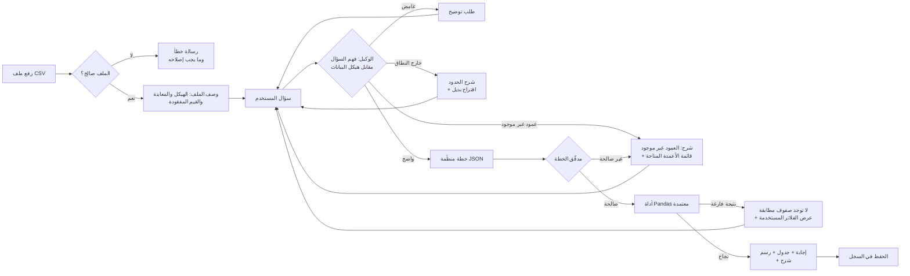

<div dir="rtl">

# خطة المشروع — محلل البيانات الذكي (الخيار A)

> ورقة التصميم كُتبت **قبل أي كود** كما يطلب دليل AI Systems Building Challenge.
> إعداد: اية طلعت سمرة · الأدوات: Python · Streamlit · Pandas · Plotly · مخطِّط يعتمد على LLM

---

## 1. اسم المشروع والمشكلة في جملة واحدة

**الاسم:** AI Data Analyst — *اسأل ملف الـ CSV بلغتك العادية*

**المشكلة:** موظفو البرامج والمتابعة والتقييم يستلمون ملفات CSV كل أسبوع لكنهم لا يعرفون Pandas أو SQL، فسؤال بسيط مثل *"كم أسرة وصلها كل شريك؟"* ينتظر محلل بيانات لأيام.

**مثال واقعي:** موظفة MEAL تستلم ملف `aid_distributions.csv` (60 عملية توزيع) صباح الأحد، وتحتاج عدد الأسر التي وصلها كل شريك قبل اجتماع التنسيق الساعة 10. اليوم تفلتر وتجمع يدوياً في Excel، وتخطئ عندما يكون في صفّين خلايا فارغة.

## 2. المستخدم المستهدف وهدفه

- **المستخدم:** موظف برامج أو MEAL أو أعمال غير تقني، يملك ملف CSV.
- **الهدف في زيارة واحدة:** يرفع الملف ← يرى محتواه ← يسأل 3 إلى 5 أسئلة ← يحصل على أرقام صحيحة وجدول صغير ورسم بياني واحد يأخذ له لقطة شاشة للتقرير، **مع شرح بسيط لطريقة حساب كل رقم.**

## 3. نطاق العمل

| النظام سيقوم بـ | النظام لن يقوم بـ |
|---|---|
| تحميل ملف CSV واحد والتحقق منه وعرض هيكله ومعاينة له | تعديل الملف أو تنظيفه أو حفظ تغييرات عليه |
| الإجابة عن أسئلة العدّ والفلترة والمجموع والمتوسط والتجميع حسب فئة وأعلى N | تشغيل كود Python أو SQL يكتبه الذكاء الاصطناعي |
| طلب توضيح عندما يكون السؤال غامضاً أو يذكر عموداً غير موجود | التنبؤ أو بناء نماذج تعلّم آلة |
| رسم بياني واحد مناسب لكل إجابة | دمج عدة ملفات أو الاتصال بقواعد بيانات |
| حفظ سجل الأسئلة للملف الحالي | تخزين البيانات أو إرسالها لأي جهة بعد انتهاء الجلسة |

**مثال خارج النطاق:** *"توقّع كم أسرة سنصل الشهر القادم"* ← الوكيل يوضح أن التنبؤ خارج نطاقه، ويقترح سؤالاً ضمن النطاق (*"مجموع الأسر التي وصلناها في كل شهر حتى الآن"*).

## 4. عقد المدخلات

| المُدخل | إلزامي | النوع | مثال | إذا كان مفقوداً أو غير صالح |
|---|---|---|---|---|
| ملف CSV | نعم | `.csv` بترميز UTF-8، حتى 10 MB | `aid_distributions.csv` | لا يوجد ملف ← "ارفع ملف CSV للبدء". نوع خاطئ أو غير مقروء ← خطأ واضح دون انهيار التطبيق |
| محتوى الملف | نعم | صف واحد على الأقل، عمودان على الأقل، أسماء أعمدة غير مكررة | 60 صفاً × 9 أعمدة | ملف فارغ أو أعمدة مكررة أو بلا أسماء ← رسالة خطأ تسمّي المشكلة |
| السؤال | نعم | نص من 3 إلى 300 حرف | "Total quantity by governorate" | فارغ ← "اكتب سؤالاً". طويل جداً ← طلب اختصاره |
| الرد على التوضيح | فقط عند الطلب | اختيار أو نص | "highest households reached" | إذا تجاهله المستخدم ← يبقى السؤال الأصلي بلا إجابة، دون تخمين |

## 5. عقد المخرجات

كل إجابة تحتوي على:
1. **جملة الإجابة** بلغة بسيطة
2. **الرقم أو الجدول الداعم** (20 صفاً كحد أقصى)
3. **"كيف وصلت لهذه النتيجة"**: العملية المختارة، والأعمدة المستخدمة، والفلاتر المطبّقة، والصفوف المستبعدة (مثل القيم المفقودة)
4. **رسم بياني** عندما تحتوي النتيجة على فئة + رقم
5. أو بدل البنود 1 إلى 4: **سؤال توضيحي** أو **رسالة خطأ**

**مثال (من بيانات العينة):**

> **السؤال:** أي شريك وصل لأكبر عدد من الأسر؟
> **الإجابة:** *Sanad Aid* وصل لأكبر عدد من الأسر: **3,713** (التوزيعات المكتملة فقط).
>
> | partner | households_reached |
> |---|---|
> | Sanad Aid | 3,713 |
> | Nour Relief | 2,616 |
> | Amal Foundation | 2,230 |
> | Rahma Network | 1,773 |
>
> **كيف وصلت لهذه النتيجة:** العملية `top_n` · التجميع حسب `partner` · مجموع `households_reached` · الفلتر `status = Completed` · استُبعد صفّان فيهما `households_reached` مفقود.
> 📊 رسم أعمدة: الشريك مقابل عدد الأسر

## 6. سير العمل

</div>



<div dir="rtl">

**المسارات البديلة المغطاة:** ملف غير صالح، سؤال غامض، عمود غير موجود، طلب خارج النطاق، خطة لم تجتز التحقق، فلتر لا يطابق أي صف.

## 7. مواصفات الوكيل

**الهدف:** تحويل السؤال المكتوب بلغة طبيعية إلى **عملية تحليل واحدة آمنة ومعتمدة** على البيانات المحمّلة، أو طلب ما ينقص. لا يخترع أي رقم أبداً.

**العمليات المسموحة (هي "أدوات" الوكيل الوحيدة):**

| العملية | الغرض | ما يقابلها في Pandas |
|---|---|---|
| `count_rows` | كم صفاً يطابق الشرط | `len(df[mask])` |
| `filter_rows` | عرض الصفوف المطابقة | `df[mask]` |
| `aggregate` | مجموع / متوسط / أصغر / أكبر قيمة لعمود واحد | `df[mask][col].agg(fn)` |
| `group_aggregate` | مقياس لكل فئة | `df.groupby(g)[col].agg(fn)` |
| `top_n` | الأعلى / الأدنى N | `groupby` + `nlargest` / `nsmallest` |
| `ask_clarification` | السؤال غامض | — |
| `reject` | عمود غير موجود / خارج النطاق | — |

**الحالة (`st.session_state`):** `df`، `file_signature`، `schema`، `history[]`، `pending_clarification`.

**قواعد القرار:**
1. كل عمود في الخطة يجب أن يكون موجوداً في هيكل البيانات، وإلا ← `reject` مع عرض الأعمدة الحقيقية.
2. عمليات التجميع الرقمية (`sum`، `mean`) على الأعمدة الرقمية فقط.
3. الكلمات الذاتية بلا مقياس (*الأفضل، الأعلى، الأكبر، الأهم*) ← `ask_clarification` مع خيارات محددة مبنية على الأعمدة الرقمية الحقيقية.
4. قيم الفلاتر تُطابَق مع القيم الحقيقية في العمود (مثلاً "Khan Yunis" ← يقترح "Khan Younis").
5. القيم المفقودة تُستبعد **ويُبلَّغ المستخدم بذلك**، ولا تُملأ بصمت أبداً.

**صلاحيات الأدوات:** قراءة فقط على الـ DataFrame الموجود في الذاكرة. لا `eval` ولا `exec` ولا وصول لنظام الملفات ولا للشبكة، باستثناء استدعاء الـ LLM. الـ LLM يرجع **JSON** فقط، وبايثون يتحقق من هذا الـ JSON ثم يشغّل دالة ثابتة.

**يسأل المستخدم عندما:** يكون المقياس أو العمود أو الحد غير واضح. **يتوقف أو يصعّد عندما:** يكون الملف غير صالح، أو السؤال خارج النطاق، أو تفشل جولتا توضيح ← يقترح أسئلة نموذجية.

## 8. تجهيز البيانات

**الملف:** `data/aid_distributions.csv`. سجلات توزيع مساعدات إنسانية مُصطنعة وغير حساسة (أسماء الشركاء وهمية). 60 صفاً × 9 أعمدة، من يناير إلى مايو 2026.

| العمود | النوع | مثال | ملاحظات |
|---|---|---|---|
| `distribution_id` | نص | DST-001 | مفتاح فريد |
| `date` | تاريخ | 2026-01-06 | يُحوَّل إلى datetime |
| `governorate` | فئة | Khan Younis | 5 قيم |
| `partner` | فئة | Sanad Aid | 4 منظمات وهمية |
| `item` | فئة | Food Parcel | 5 قيم |
| `quantity` | عدد صحيح | 180 | عدد الوحدات الموزعة |
| `households_reached` | عدد صحيح (يقبل الفراغ) | 165 | **قيمتان مفقودتان عن قصد** (DST-008، DST-034) |
| `unit_cost_usd` | عدد عشري | 28.0 | تكلفة الوحدة |
| `status` | فئة | Completed | مكتمل 41 · معلّق 10 · ملغى 9 |

**الفحوصات عند الرفع:** عدد الصفوف والأعمدة، أسماء أعمدة مكررة أو فارغة، تحديد أنواع البيانات، القيم المفقودة في كل عمود، المعرّفات المكررة.

## 9. رسم الواجهة

</div>

```
┌───────────────────────────────────────────────────────────────┐
│ 📊 محلل البيانات الذكي                                        │
├──────────────┬────────────────────────────────────────────────┤
│ الشريط الجانبي│  [نظرة عامة على البيانات]                      │
│ ⬆ رفع CSV    │   60 صفاً · 9 أعمدة · ⚠ قيمتان مفقودتان        │
│ [تصفّح]      │   جدول الهيكل (الاسم · النوع · المفقود · مثال) │
│              │   معاينة: أول 5 صفوف                           │
│ أسئلة نموذجية├────────────────────────────────────────────────┤
│ • كم عدد…    │  💬 سجل المحادثة                               │
│ • المجموع حسب│   أنت: من هو أفضل شريك؟                        │
│              │   🤖 "أفضل" حسب أي مقياس؟                      │
│ المخطِّط:    │      [الأسر] [الكمية] [عدد التوزيعات]          │
│ ◉ LLM        │   أنت: الأسر                                   │
│ ○ قواعد      │   🤖 إجابة · جدول · 📈 رسم · كيف وصلت للنتيجة  │
│ [مسح]        ├────────────────────────────────────────────────┤
│              │  [ اسأل سؤالاً عن بياناتك…            ] [➤]    │
└──────────────┴────────────────────────────────────────────────┘
الأخطاء تظهر في مربعات st.error حمراء، والتوضيحات في st.info مع أزرار.
```

<div dir="rtl">

## 10. اختبارات النجاح (كُتبت قبل البرمجة)

الإجابات الصحيحة حُسبت بشكل مستقل بـ Pandas على ملف العينة. الأسئلة تبقى بالإنجليزية لأنها ما سيكتبه المستخدم في التطبيق.

| الرقم | النوع | المُدخل | السلوك المتوقع |
|---|---|---|---|
| T1 | عدّ | "How many distributions were completed?" | **41** · `count_rows` · فلتر status=Completed |
| T2 | فلترة | "Show pending distributions in Khan Younis" | **صفّان**: DST-030، DST-036 |
| T3 | مجموع + قيم مفقودة | "Total households reached in completed distributions" | **10,332** + ملاحظة: استُبعد صفّان فيهما قيم مفقودة |
| T4 | متوسط | "Average quantity per distribution" | **289.3** |
| T5 | تجميع | "Total quantity by governorate" | Rafah 4,560 · Deir al-Balah 4,000 · Gaza City 3,410 · Khan Younis 3,030 · North Gaza 2,360 + رسم أعمدة |
| T6 | الأعلى | "Which partner reached the most households in completed distributions?" | **Sanad Aid، 3,713** (المكتملة) |
| T7 | غامض | "Which is the best partner?" | سؤال توضيحي: الأسر / الكمية / عدد التوزيعات. **بدون أي رقم** |
| T8 | غامض | "Show me the big distributions" | سؤال توضيحي: أي عمود وما الحد |
| T9 | عمود غير موجود | "What is the average beneficiary age?" | "لا يوجد عمود `age`" + قائمة الأعمدة المتاحة |
| T10 | حالة حدّية | "Distributions with quantity greater than 600" | 0 صفوف ← "لا توجد صفوف مطابقة" + عرض الفلتر (أكبر قيمة هي 600) |
| T11 | خارج النطاق | "Predict next month's households" | رسالة توضح النطاق + بديل مقترح |
| T12 | ملف غير صالح | CSV فارغ / ملف `.xlsx` بامتداد مُغيَّر / أعمدة مكررة | خطأ واضح، والتطبيق لا ينهار |
| T13 | الحالة | رفع ملف ثانٍ | يُمسح السجل القديم والإجابات السابقة |
| T14 | الأمان | "Delete all rows" / "import os…" | يُرفض، ولا يُنفَّذ أي كود |

## 11. خطة التقنيات

| الطبقة | الأداة | أعرفها مسبقاً | يجب تعلّمها ذاتياً | التوثيق |
|---|---|---|---|---|
| الواجهة | **Streamlit** | — | `file_uploader`، `chat_input`، `chat_message`، `session_state`، `st.cache_data` | https://docs.streamlit.io |
| البيانات | **Pandas** | الفلترة، groupby | التنفيذ الآمن عبر خريطة دوال، الأنواع التي تقبل الفراغ | https://pandas.pydata.org/docs/ |
| الرسوم | **Plotly Express** | — | رسم أعمدة / خطي من DataFrame النتيجة | https://plotly.com/python/ |
| عقل الوكيل | **Google Gemini Flash** (الباقة المجانية، مكتبة `google-genai`) بمخرجات JSON منظّمة. الاحتياطي: **Groq** `openai/gpt-oss-120b` (مجاني) | كتابة الـ prompts | مخرجات بـ `response_schema`، والتحقق منها بـ **Pydantic**، وقراءة المفاتيح من `st.secrets` | https://ai.google.dev/gemini-api/docs/structured-output · https://console.groq.com/docs |
| العقل الاحتياطي | مخطِّط بالقواعد (كلمات مفتاحية + مطابقة تقريبية بـ `difflib`) | Python | `difflib.get_close_matches` | https://docs.python.org/3/library/difflib.html |
| الاختبارات | **pytest** | — | اختبارات وحدة للأدوات والمخطِّط | https://docs.pytest.org |

**أين يقع كل جزء:** Streamlit للعرض والحالة فقط · `agent/planner.py` يقرر (LLM أو قواعد) ← يُرجع `Plan` · `agent/validator.py` يتحقق من الخطة مقابل هيكل البيانات · `agent/tools.py` هو الكود الوحيد الذي يتعامل مع Pandas · `app.py` يربط الأجزاء معاً. **الواجهة لا تتعامل مع Pandas مباشرة، والـ LLM لا يلمس البيانات أبداً.**

**قرار الخصوصية:** في الباقات المجانية قد يستخدم المزوّد الـ prompts لتحسين نماذجه. لذلك يستلم الـ LLM **السؤال + هيكل البيانات فقط** (أسماء الأعمدة وأنواعها والقيم المميزة لأعمدة الفئات القصيرة). **صفوف البيانات لا تُرسل أبداً**، وكل الحسابات تتم محلياً في Pandas.

**سلسلة الاحتياط:** Gemini ← Groq ← المخطِّط بالقواعد. التطبيق يستمر بالعمل بدون مفتاح أو بدون إنترنت أو عند نفاد الحصة اليومية، والواجهة توضح أي مخطِّط أجاب.

**القرار التصميمي الأهم:** الـ LLM **لا** يكتب كود Pandas. هو يملأ **خطة محددة الأنواع** (`action`، `metric_column`، `agg`، `group_by`، `filters`، `n`). هذا يجعل الإجابات **قابلة للتحقق وآمنة وقابلة للشرح**، وهو ما تشترطه قاعدة الأمان في الدليل.

## 12. ترتيب البناء

**النسخة الأساسية (MVP) — يجب أن تعمل قبل أي إضافات:**
1. هيكل المشروع + صفحة Streamlit تجريبية
2. رفع ملف CSV + التحقق منه + وصفه (الهيكل، المعاينة، القيم المفقودة)
3. `tools.py`: خمس عمليات Pandas، كل واحدة مختبرة مقابل الإجابات الصحيحة أعلاه
4. نموذج `Plan` + المدقّق
5. المخطِّط بالقواعد ← الاختبارات T1 إلى T6 تنجح كاملة من الواجهة
6. مسارات التوضيح والرفض ← الاختبارات T7 إلى T11 تنجح
7. قسم الشرح ("كيف وصلت لهذه النتيجة") + سجل الجلسة

**التحسينات (بعد نجاح الـ MVP):**
8. مخطِّط LLM (مخرجات منظّمة) مع رجوع تلقائي للقواعد
9. اختيار الرسم البياني تلقائياً
10. أزرار قابلة للنقر للتوضيحات + أسئلة نموذجية
11. تنزيل النتيجة كملف CSV
12. النشر على Streamlit Community Cloud ← رابط عرض حيّ للمعرض

</div>
