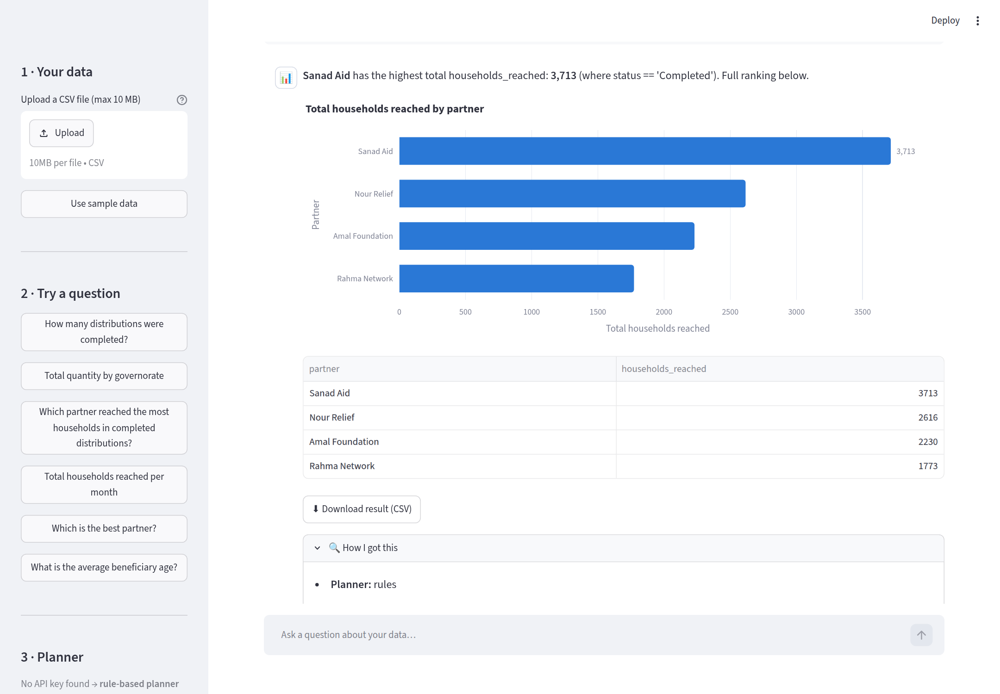
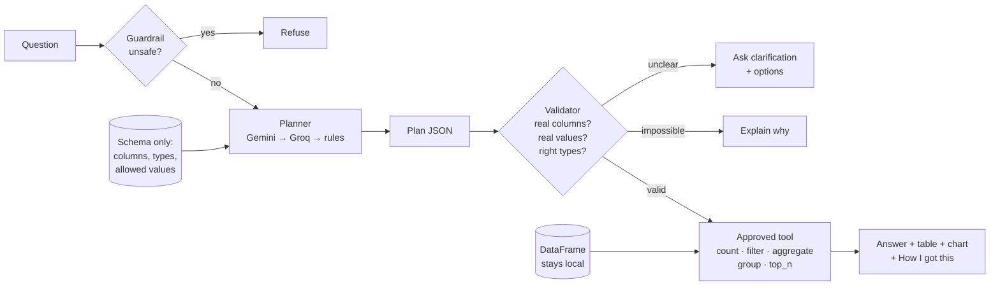
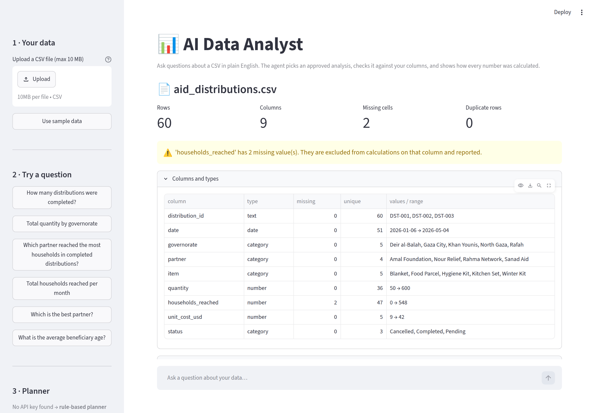
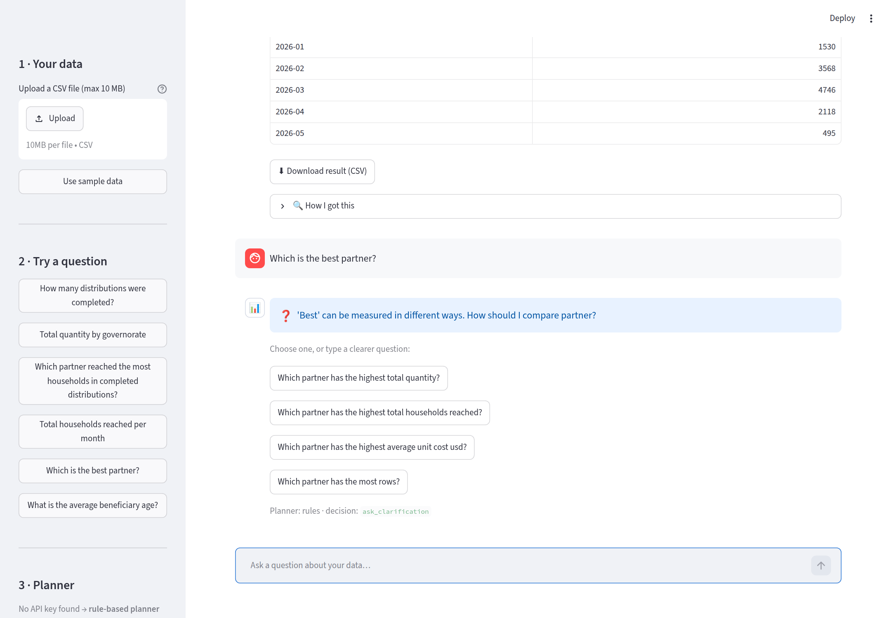
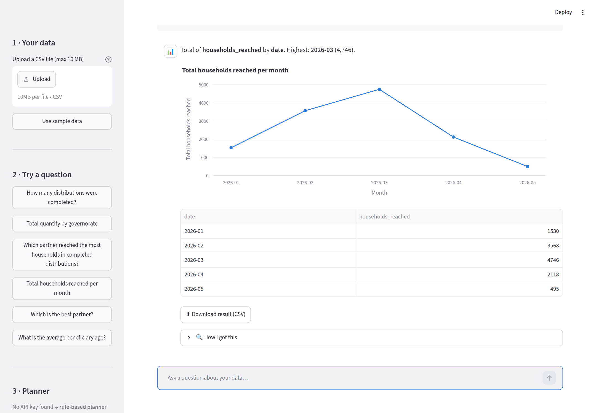
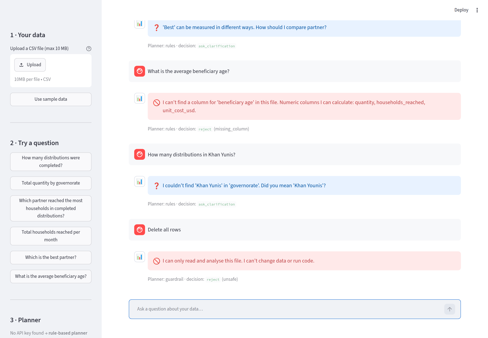

# 📊 AI Data Analyst

**Ask a CSV file questions in plain English and get correct, explainable answers.**
An AI agent plans the analysis, code validates the plan against the real columns, and approved Pandas functions compute every number. The AI never invents a figure and never sees your data rows.




---

## The problem

Programme and M&E officers receive CSV exports every week, but most cannot write Pandas or SQL. A simple question such as *"how many households did each partner reach?"* waits days for an analyst, or is summed by hand in Excel, where two empty cells quietly produce a wrong total.

**Who it is for:** a non-technical programme, MEAL or business officer who owns a CSV file.
**Goal in one visit:** upload → understand the file → ask 3–5 questions → get correct numbers, a table and a chart for a report, plus a plain explanation of how each number was calculated.

## What it does

| | |
|---|---|
| 📂 **Validates the file** | Rejects empty files, duplicate or blank headers, and Excel files renamed to `.csv`, with a message that says what to fix. Reads Arabic Windows/Excel encodings. |
| 🧭 **Describes the data** | Row/column counts, detected types, category values, numeric ranges and missing values, before any question is asked. |
| 💬 **Answers questions** | Counts, filters, totals, averages, group-by, top-N and monthly trends. |
| ❓ **Asks instead of guessing** | "Which is the best partner?" → *best by households, quantity or number of distributions?* with one-click options. "Khan Yunis" → *Did you mean 'Khan Younis'?* |
| 🔍 **Explains every number** | "How I got this": planner used, action, columns, filters, rows used and **rows excluded because values were missing**. |
| 🛡️ **Knows its limits** | Missing columns, forecasts and requests to change data or run code are refused with a reason. |
| 📈 **Charts when useful** | Sorted bar chart for categories, line chart for months, no chart for a single number. |

## How it works



### The key design decision: the AI plans, code computes

The common pattern of asking an LLM to *write Pandas code and run it* is unsafe and hard to verify. Here the LLM fills a **typed plan** (`action`, `column`, `agg`, `group_by`, `filters`, `n`) through structured output, and that is all it can do:

1. **Safe.** No `eval`/`exec`. Only 5 read-only functions can run.
2. **Verifiable.** Every function is unit-tested against numbers computed independently.
3. **No invented numbers.** The answer sentence is written by a template from the tool result. Even if a prompt injection succeeds, the plan has no field to put a number in.
4. **Private.** The LLM receives the question and the **schema only**, never the data rows. A test checks that none of the 60 record IDs appears in the prompt.
5. **Always available.** If Gemini fails (quota, network, invalid JSON), Groq is tried, then a rule-based planner. The UI shows which one answered.

### Agent specification

| | |
|---|---|
| **Goal** | Turn a question into one safe, approved analysis over the loaded file, or ask for what is missing |
| **Actions** | `count_rows` · `filter_rows` · `aggregate` · `group_aggregate` · `top_n` · `ask_clarification` · `reject` |
| **State** | dataset, profile, file signature, chat history, pending clarification (`st.session_state`) |
| **Asks when** | the measure, column, threshold or category value is unclear |
| **Stops when** | the file is invalid, the question is out of scope, or the request is unsafe |

## Screenshots

| Data overview | Clarification instead of a guess |
|---|---|
|  |  |
| **Monthly trend** | **Guardrails: missing column, misspelling, unsafe request** |
|  |  |

## Run it locally

**Requirements:** Python 3.10+. An API key is optional: without one, the rule-based planner is used.

```bash
git clone https://github.com/ayatalat0101/ai-data-analyst.git
cd ai-data-analyst
python -m venv .venv
# Windows: .venv\Scripts\Activate.ps1     macOS/Linux: source .venv/bin/activate
pip install -r requirements.txt
```

**Optional: enable the AI planner (free).** Create a key at [Google AI Studio](https://aistudio.google.com), then:

```bash
# Windows: copy .streamlit\secrets.toml.example .streamlit\secrets.toml
cp .streamlit/secrets.toml.example .streamlit/secrets.toml
# paste your key into .streamlit/secrets.toml  (this file is git-ignored)
```

**Run:**

```bash
streamlit run app.py        # the app → click "Use sample data"
pytest -q                   # 86 tests, no API key or internet needed
python benchmark.py         # rule vs LLM planner → BENCHMARK.md
```

### Example questions

- How many distributions were completed?
- Total quantity by governorate
- Which partner reached the most households in completed distributions?
- Total households reached per month
- Which is the best partner? *(asks for clarification)*
- What is the average beneficiary age? *(no such column: explains)*

## Deploy your own live demo (free)

1. Push the repository to GitHub.
2. Go to [share.streamlit.io](https://share.streamlit.io) → **Create app** → pick the repo, branch `main`, main file `app.py`.
3. **Advanced settings → Secrets:** paste the contents of `.streamlit/secrets.toml.example` with your real key. Keys never go in the repository.
4. Deploy. Without a key the demo still works with the rule-based planner.

On a public demo every visitor shares your free Gemini quota. `AI_QUESTIONS_PER_SESSION` (default 20) caps AI-planned questions per visitor; after that, and whenever Gemini returns a quota error, the rule planner answers and the UI says so.

## Project structure

```
ai-data-analyst/
├── app.py                 Streamlit UI: presentation and state only
├── charts.py              chooses a chart only when it helps
├── agent/
│   ├── data_loader.py     CSV validation + profile (the schema the planner sees)
│   ├── plan.py            the Plan model = the LLM's response schema
│   ├── rule_planner.py    offline planner (MVP, fallback, baseline)
│   ├── llm_planner.py     Gemini → Groq chain, prompt, parsing, cache
│   ├── validator.py       checks every plan against the real data
│   ├── tools.py           the ONLY code that touches the DataFrame
│   └── agent.py           guardrail → plan → validate → tool → answer
├── tests/                 86 pytest tests
├── data/aid_distributions.csv   synthetic sample (60 rows, fictional partners)
├── benchmark.py           planner comparison on 18 questions
├── PROJECT_PLAN.md        design sheet written before coding
├── TEST_RESULTS.md        expected vs actual, defects found and fixed
└── BENCHMARK.md           benchmark output
```

## Testing

- **86 automated tests** cover the file loader, the five tools against Pandas ground truth, the agent end to end (T1–T14), and the LLM path with fake backends (no internet needed).
- **Defects found and fixed during testing** are documented in [`TEST_RESULTS.md`](TEST_RESULTS.md). One example: a misspelled "Khan Yunis" originally returned the count for *all* rows. It now asks *"Did you mean…?"*.
- **Benchmark** ([`BENCHMARK.md`](BENCHMARK.md)): the rule planner scores 14/18 and fails on paraphrases ("families", "area", "handed out"). Those are the cases the LLM planner is there to handle.

## What I learned (self-learned for this project)

| Tool / technique | What I used it for |
|---|---|
| **Streamlit** | `file_uploader`, `chat_input`/`chat_message`, `session_state` across re-runs, callbacks, `cache_resource` |
| **Structured LLM output** | Gemini `response_json_schema` + Groq `json_schema` from one Pydantic model |
| **Pydantic** | the plan contract shared by the rule planner, the LLM and the validator |
| **Agent design** | allowed actions, validation between *deciding* and *doing*, clarification paths, deterministic guardrails |
| **Testing LLM systems** | fake backends for our own code, a separate benchmark for model quality, mutation testing |
| **Plotly** | single-series bar and line charts with readable axes |

## Known limitations

- Questions in **English** only. Column names and values can be in any language.
- **One file, one analysis per question.** No joins, ratios/percentages or multi-step questions yet.
- The **rule planner** matches words, not meaning (see benchmark). The LLM planner needs a key and internet.
- **Free-tier quotas are small and change often.** In testing, Gemini Flash returned `429` after a few quick questions (mostly the per-minute limit; check yours at [AI Studio → rate limits](https://aistudio.google.com/rate-limit)), so the default is `gemini-flash-lite-latest`. After a quota error (429) the agent pauses that model and continues with Groq or rules (circuit breaker), and the explanation shows why.
- On the **free Gemini tier**, prompts may be used by Google to improve models. That is why only the schema, never the rows, is sent. Category *values* (e.g. partner names) are part of the schema.
- Chat history lives in the browser session and disappears on refresh. Nothing is stored on a server.
- CSV only (≤ 10 MB). Excel files must be saved as CSV first.

## Roadmap

- [ ] Percentages and ratios ("share of cancelled distributions")
- [ ] Arabic questions
- [ ] Two-step plans ("compare Rafah and Khan Younis by month")
- [ ] Deploy on Streamlit Community Cloud with a live demo link

## About

Built by **Aya Talat Samra**, software engineer moving into humanitarian information management and MEAL, as part of the *AI Systems Building Challenge* (Option A).
[Portfolio](https://Ayatalat.github.io) · [GitHub](https://github.com/Ayatalat)

Sample data is synthetic and contains no real people or organisations. MIT License.
